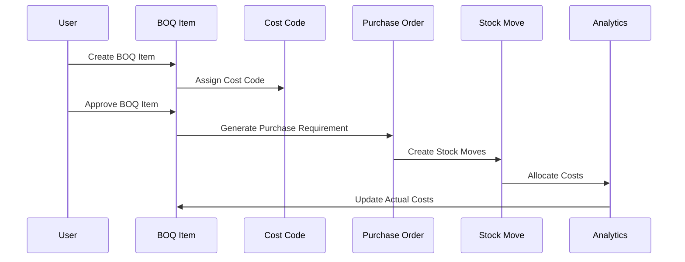
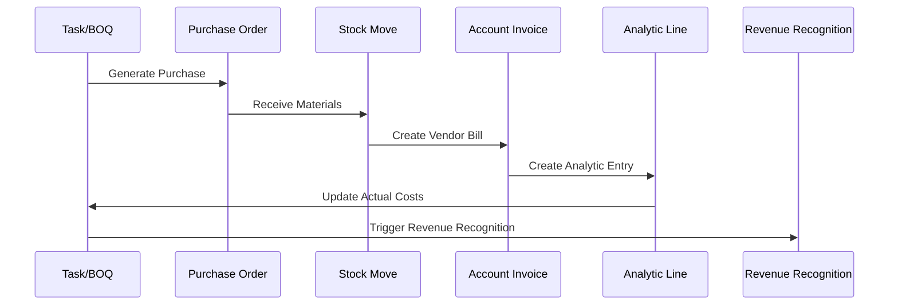

# Construction Management Module - Technical Architecture

## 🏗️ System Architecture Overview

The Construction Management module follows a layered architecture pattern built on top of Odoo 17 Enterprise's standard framework. The system extends core Odoo modules while maintaining full compatibility and leveraging existing functionality.

## 📐 Architectural Principles

### 1. **Extension Over Replacement**
- Extends existing Odoo models (`project.project`, `project.task`, `product.template`)
- Preserves standard Odoo functionality while adding construction-specific features
- Maintains compatibility with other Odoo modules

### 2. **Separation of Concerns**
- **Models**: Business logic and data management
- **Views**: User interface and presentation
- **Controllers**: API endpoints and web interactions
- **Wizards**: Complex user interactions and workflows

### 3. **Data Integrity**
- Comprehensive validation using `@api.constrains`
- SQL constraints for database-level integrity
- Audit trails through `mail.thread` inheritance
- Proper cascade deletion and orphan handling

### 4. **Configuration Menu Architecture**
- Comprehensive 8-section configuration menu structure
- Role-based access control with proper security groups
- Standard Odoo action integration with custom construction actions
- Extensible design for future module enhancements

## 🔧 Core Components

### Model Extensions

#### Project Management Layer
```python
# construction_project.py
class ConstructionProject(models.Model):
    _inherit = 'project.project'
    
    # Construction-specific fields
    construction_type = fields.Selection([...])
    site_location = fields.Text(...)
    contract_value = fields.Monetary(...)
    
    # Computed fields for dashboard
    total_boq_value = fields.Monetary(compute='_compute_boq_totals')
    committed_costs = fields.Monetary(compute='_compute_committed_costs')
    actual_costs = fields.Monetary(compute='_compute_actual_costs')
```

#### BOQ Management Layer
```python
# construction_task.py
class ConstructionTask(models.Model):
    _inherit = 'project.task'
    
    # BOQ identification
    is_boq_item = fields.Boolean(...)
    boq_code = fields.Char(...)
    cost_code_id = fields.Many2one('construction.cost.code')
    
    # Quantity and cost tracking
    estimated_quantity = fields.Float(...)
    revised_quantity = fields.Float(...)
    actual_quantity = fields.Float(...)
    boq_value = fields.Monetary(compute='_compute_boq_value')
```

### Custom Models

#### Cost Code System
```python
# construction_cost_code.py
class ConstructionCostCode(models.Model):
    _name = 'construction.cost.code'
    _inherit = ['mail.thread', 'mail.activity.mixin']
    
    # Hierarchical structure
    parent_id = fields.Many2one('construction.cost.code')
    child_ids = fields.One2many('construction.cost.code', 'parent_id')
    
    # Product integration
    product_template_id = fields.Many2one('product.template')
    product_category_id = fields.Many2one('product.category')
```

#### Subcontractor Management
```python
# construction_subcontractor.py
class ConstructionSubcontractor(models.Model):
    _name = 'construction.subcontractor'
    _inherit = ['mail.thread', 'mail.activity.mixin']
    
    # Contract management
    contract_value = fields.Monetary(...)
    retention_percentage = fields.Float(...)
    
    # Progress tracking
    progress_percentage = fields.Float(compute='_compute_progress')
    milestone_ids = fields.One2many('construction.subcontractor.milestone')
```

#### Project Template System
```python
# construction_project_template.py
class ConstructionProjectTemplate(models.Model):
    _name = 'construction.project.template'
    _inherit = ['mail.thread', 'mail.activity.mixin']
    
    # Template information
    name = fields.Char(required=True)
    construction_category = fields.Selection([
        ('elv', 'Extra Low Voltage (ELV)'),
        ('mep', 'Mechanical, Electrical & Plumbing (MEP)'),
        ('civil', 'Civil Works'),
        ('general', 'General Construction'),
    ])
    
    # Template components
    task_template_ids = fields.One2many('construction.task.template')
    boq_template_ids = fields.One2many('construction.boq.template')
    milestone_template_ids = fields.One2many('construction.milestone.template')
    
    # Approval workflow
    state = fields.Selection([
        ('draft', 'Draft'),
        ('review', 'Under Review'),
        ('approved', 'Approved'),
        ('archived', 'Archived'),
    ])
    
    def _apply_construction_template(self, project):
        """Apply template to project with complete BOQ structure"""
        self._apply_template_tasks(project)
        self._apply_template_boq_items(project)
        self._apply_template_milestones(project)
        self._apply_template_cost_estimations(project)
```

#### Sale Order Integration
```python
# Extended sale.order for template integration
class SaleOrder(models.Model):
    _inherit = "sale.order"
    
    def action_confirm(self):
        """Override to apply construction templates"""
        result = super().action_confirm()
        
        # Apply construction templates to created projects
        for order in self:
            order._apply_construction_templates_to_projects()
        
        return result
    
    def _apply_construction_templates_to_projects(self):
        """Apply templates based on construction products"""
        projects = self.env['project.project'].search([
            ('sale_order_id', '=', self.id)
        ])
        
        for project in projects:
            construction_template = self._get_construction_template_for_project(project)
            if construction_template:
                project.write({
                    'is_construction': True,
                    'construction_template_id': construction_template.id,
                })
                construction_template._apply_construction_template(project)
```

## 🔧 Configuration Menu Architecture

### Menu Structure Design

The Construction Management module implements a comprehensive configuration menu organized into 8 logical sections with proper sequencing and security controls:

```xml
<!-- Main Configuration Menu -->
<menuitem id="menu_construction_configuration"
          name="Configuration"
          parent="menu_construction_root"
          sequence="100"/>

<!-- Section-based Organization -->
Master Data (10) → Partners (20) → Project Settings (30) → Financial Settings (40)
Document Management (50) → Quality & Safety (60) → System Settings (70) → Data Management (80)
```

### Security Integration

```xml
<!-- Role-based Access Control -->
<menuitem id="menu_construction_config_system"
          name="System Settings"
          groups="base.group_system"
          sequence="70"/>

<menuitem id="menu_construction_config_sequences"
          name="Sequences"
          groups="base.group_system"
          sequence="10"/>
```

### Action Integration Strategy

The configuration menu leverages both standard Odoo actions and custom construction actions:

**Standard Odoo Actions (Reused):**
- `base.action_partner_customer_form` - Customer management
- `product.product_template_action_all` - Product catalog
- `account.action_account_form` - Chart of accounts
- `base.ir_sequence_form` - Sequence management

**Custom Construction Actions:**
- `construction_management.action_construction_cost_code` - Cost code management
- `construction_management.action_construction_subcontractor` - Subcontractor management
- `construction_management.action_construction_document_directory` - Document types

### Extensibility Framework

The modular menu structure supports:
- **Easy Extension**: New sections can be added with appropriate sequence numbers
- **Module Integration**: Other modules can extend existing sections
- **Customization**: Menu items can be customized without core changes
- **Maintenance**: Clear organization for future updates

For complete configuration menu documentation, see [CONFIGURATION_MENU.md](CONFIGURATION_MENU.md).

## 🔄 Data Flow Architecture

### BOQ to Procurement Flow


### Financial Integration Flow


## 🗄️ Database Design

### Core Tables and Relationships

#### Extended Tables
- `project_project` - Enhanced with construction fields
- `project_task` - Enhanced with BOQ functionality
- `product_template` - Enhanced with construction integration
- `product_category` - Enhanced with cost code mapping

#### New Tables
- `construction_cost_code` - Hierarchical cost code system
- `construction_subcontractor` - Subcontractor management
- `construction_subcontractor_milestone` - Milestone tracking
- `construction_revenue_recognition` - Revenue recognition
- `construction_document_directory` - Document organization
- `construction_submittal` - Submittal management
- `construction_quality_inspection` - Quality tracking
- `construction_incident` - Safety incident management
- `construction_project_template` - Project template system
- `construction_task_template` - Task template definitions
- `construction_boq_template` - BOQ item templates
- `construction_milestone_template` - Milestone templates
- `construction_cost_estimation_template` - Cost estimation templates
- `construction_template_version` - Template versioning system

### Indexing Strategy
```sql
-- Performance indexes for construction queries
CREATE INDEX idx_construction_cost_code_hierarchy ON construction_cost_code(parent_id, code);
CREATE INDEX idx_project_task_boq ON project_task(project_id, is_boq_item, boq_state);
CREATE INDEX idx_purchase_line_construction ON purchase_order_line(construction_project_id, boq_task_id);
CREATE INDEX idx_analytic_line_construction ON account_analytic_line(account_id, task_id);
```

## 🔐 Security Architecture

### Access Control Layers

#### 1. **Group-Based Security**
```xml
<!-- construction_security.xml -->
<record id="group_construction_user" model="res.groups">
    <field name="name">Construction User</field>
    <field name="implied_ids" eval="[(4, ref('project.group_project_user'))]"/>
</record>

<record id="group_construction_manager" model="res.groups">
    <field name="name">Construction Manager</field>
    <field name="implied_ids" eval="[(4, ref('group_construction_user'))]"/>
</record>
```

#### 2. **Record Rules**
```xml
<!-- Project-based access control -->
<record id="construction_project_rule" model="ir.rule">
    <field name="name">Construction Project Access</field>
    <field name="model_id" ref="model_project_project"/>
    <field name="domain_force">['|', ('user_id', '=', user.id), ('member_ids', 'in', [user.id])]</field>
</record>
```

#### 3. **Field-Level Security**
```csv
# ir.model.access.csv
access_construction_cost_code_user,construction.cost.code.user,model_construction_cost_code,group_construction_user,1,0,0,0
access_construction_cost_code_manager,construction.cost.code.manager,model_construction_cost_code,group_construction_manager,1,1,1,0
```

## 🚀 Performance Optimization

### BOQ Code Conflict Resolution Optimization (Latest Update)
```python
# Optimized BOQ conflict resolution with single query approach
def _resolve_boq_code_conflict_optimized(
    self, original_code, existing_boq_codes, boq_code_map, conflict_resolution, project_name
):
    """Optimized BOQ code conflict resolution using single query and in-memory processing
    
    Performance Improvements:
    - Single database query instead of N queries in loops
    - O(1) database complexity regardless of template size
    - In-memory processing using sets and dictionaries
    - 90-99% performance improvement for large templates
    """
    
    # Check if already resolved (in-memory lookup)
    if original_code in boq_code_map:
        return boq_code_map[original_code]
    
    # Check for conflicts in memory (no database query)
    if original_code not in existing_boq_codes:
        boq_code_map[original_code] = original_code
        existing_boq_codes.add(original_code)
        return original_code
    
    # Resolve conflicts in memory (no database queries)
    counter = 1
    new_code = f"{original_code}-{counter:03d}"
    while (new_code in existing_boq_codes or new_code in boq_code_map.values()):
        counter += 1
        new_code = f"{original_code}-{counter:03d}"
    
    # Update maps for future lookups
    boq_code_map[original_code] = new_code
    existing_boq_codes.add(new_code)
    return new_code

# Setup for optimized approach (single query upfront)
existing_tasks = self.env["project.task"].search([
    ("project_id", "=", project.id),
    ("is_boq_item", "=", True),
    ("boq_code", "!=", False)
])
existing_boq_codes = set(existing_tasks.mapped('boq_code'))
boq_code_map = {}  # Track resolved codes
```

### Computed Field Optimization
```python
# Efficient computed fields with proper dependencies
@api.depends('task_ids.boq_value', 'task_ids.is_boq_item')
def _compute_boq_totals(self):
    """Optimized BOQ total calculation"""
    for project in self:
        boq_tasks = project.task_ids.filtered('is_boq_item')
        project.total_boq_value = sum(boq_tasks.mapped('boq_value'))
```

### Database Query Optimization
```python
# Batch operations for better performance
def _compute_actual_costs(self):
    """Optimized actual cost calculation using batch queries"""
    projects_with_analytic = self.filtered('analytic_account_id')
    if not projects_with_analytic:
        self.update({'actual_costs': 0.0})
        return
    
    # Single query for all projects
    analytic_data = self.env['account.analytic.line'].read_group(
        domain=[
            ('account_id', 'in', projects_with_analytic.mapped('analytic_account_id').ids),
            ('amount', '<', 0)
        ],
        fields=['account_id', 'amount:sum'],
        groupby=['account_id']
    )
    
    # Map results back to projects
    analytic_dict = {item['account_id'][0]: abs(item['amount']) for item in analytic_data}
    for project in projects_with_analytic:
        project.actual_costs = analytic_dict.get(project.analytic_account_id.id, 0.0)
```

## 🔌 Integration Points

### Odoo Module Integration

#### 1. **Project Module Integration**
- Extends `project.project` and `project.task`
- Leverages project stages and milestones
- Integrates with project analytics and reporting

#### 2. **Product Module Integration**
- Extends `product.template` and `product.category`
- Integrates with product variants and attributes
- Leverages supplier information and pricelists

#### 3. **Purchase Module Integration**
- Extends `purchase.order.line`
- Integrates with purchase workflows and approvals
- Leverages vendor management and procurement rules

#### 4. **Stock Module Integration**
- Extends `stock.move` and `stock.move.line`
- Integrates with inventory valuation
- Leverages lot and serial number tracking

#### 5. **Accounting Module Integration**
- Extends `account.move.line`
- Integrates with analytic accounting
- Leverages journal entries and reconciliation

### External System Integration

#### API Endpoints
```python
# controllers/api.py
class ConstructionAPI(http.Controller):
    
    @http.route('/api/construction/projects', auth='user', methods=['GET'])
    def get_projects(self, **kwargs):
        """RESTful API for project data"""
        projects = request.env['project.project'].search([
            ('is_construction', '=', True)
        ])
        return {'projects': projects.read(['name', 'construction_type', 'contract_value'])}
    
    @http.route('/api/construction/boq', auth='user', methods=['POST'])
    def create_boq_item(self, **kwargs):
        """API for BOQ item creation"""
        # Implementation for external BOQ import
        pass
```

## 📊 Monitoring and Logging

### Performance Monitoring
```python
# models/construction_monitoring.py
class ConstructionMonitoring(models.TransientModel):
    _name = 'construction.monitoring'
    
    def monitor_performance(self):
        """Monitor system performance metrics"""
        # Track query performance
        # Monitor memory usage
        # Log slow operations
        pass
```

### Audit Logging
```python
# All critical models inherit mail.thread for audit trails
class ConstructionCostCode(models.Model):
    _inherit = ['mail.thread', 'mail.activity.mixin']
    
    @api.model
    def create(self, vals):
        record = super().create(vals)
        record.message_post(
            body=f'Cost code created with type: {record.cost_type}',
            message_type='notification'
        )
        return record
```

## 🧪 Testing Architecture

### Test Structure
```
tests/
├── test_construction_project.py     # Project functionality tests
├── test_cost_code.py                # Cost code system tests
├── test_document_management.py      # Document workflow tests
├── test_financial_integration.py    # Financial integration tests
└── test_subcontractor.py           # Subcontractor management tests
```

### Test Coverage Strategy
```python
# Example test structure
class TestConstructionProject(TransactionCase):
    
    def setUp(self):
        super().setUp()
        # Set up test data
        self.project = self.env['project.project'].create({...})
        self.cost_code = self.env['construction.cost.code'].create({...})
    
    def test_boq_value_calculation(self):
        """Test BOQ value computation"""
        # Test implementation
        pass
    
    def test_cost_variance_analysis(self):
        """Test cost variance calculations"""
        # Test implementation
        pass
```

## 🔄 Deployment Architecture

### Module Dependencies
```python
# __manifest__.py
'depends': [
    # Core Odoo modules
    'base', 'mail', 'portal', 'web',
    
    # Project management
    'project', 'project_account', 'sale_project',
    
    # Procurement and inventory
    'purchase', 'stock', 'stock_account',
    
    # Accounting and analytics
    'account', 'analytic'
    
    # Supporting modules
    'rating', 'resource', 'hr_timesheet', 'digest',
],
```

### Installation Hooks
```python
# hooks.py
def post_init_hook(cr, registry):
    """Post-installation setup"""
    # Create default cost code structure
    # Set up security groups
    # Initialize demo data
    pass

def uninstall_hook(cr, registry):
    """Clean uninstallation"""
    # Clean up custom data
    # Preserve audit trails
    pass
```

This technical architecture provides a comprehensive foundation for the Construction Management module, ensuring scalability, maintainability, and integration with Odoo's ecosystem while delivering construction-specific functionality.