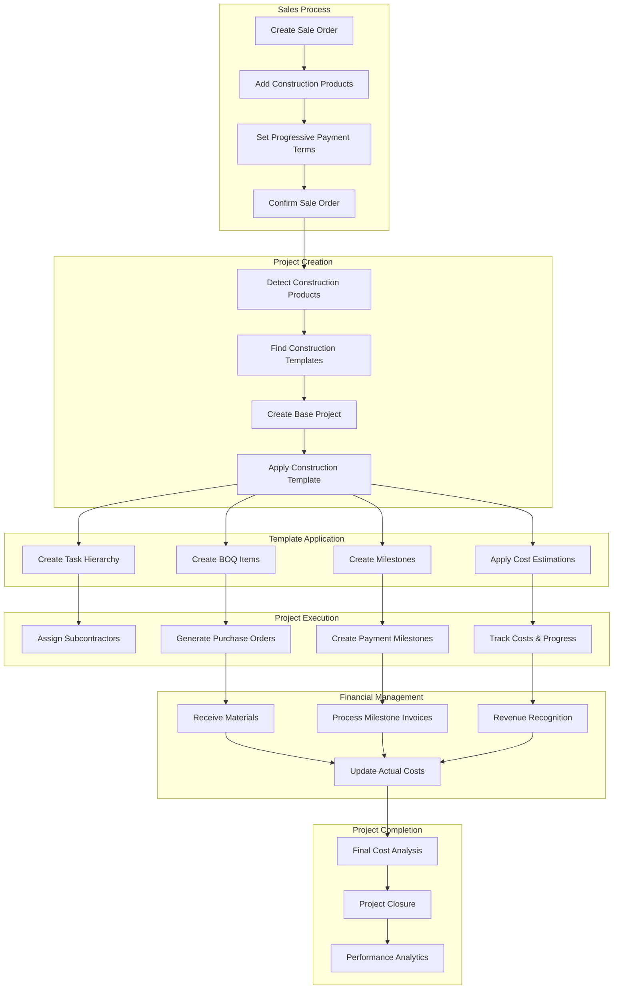
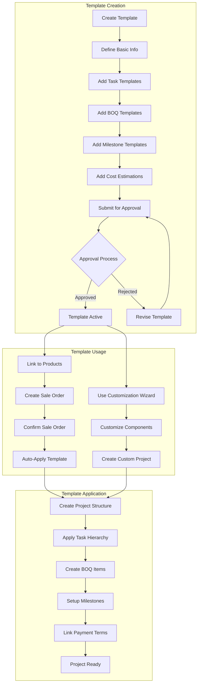
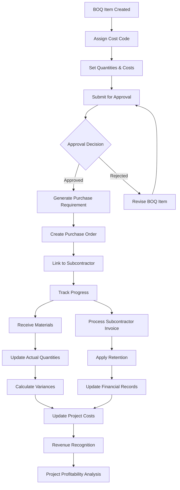
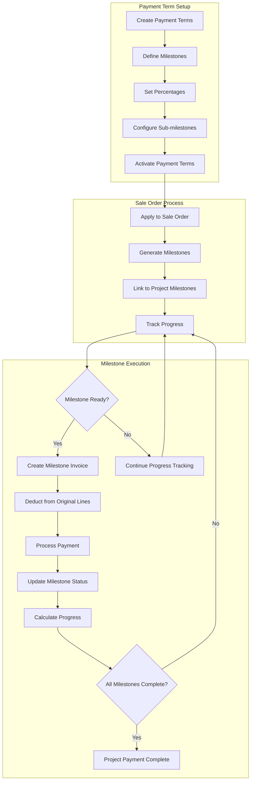
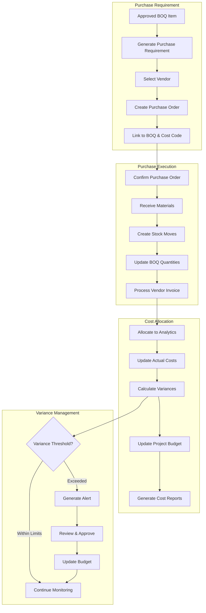
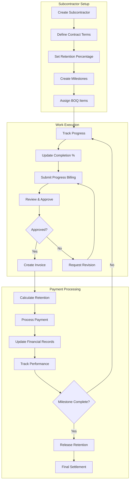
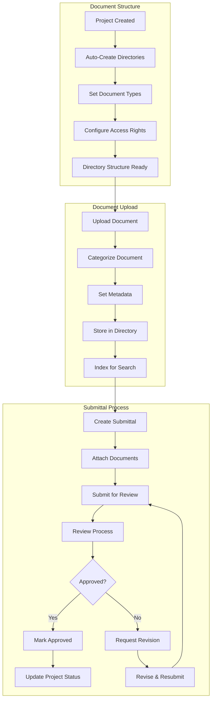
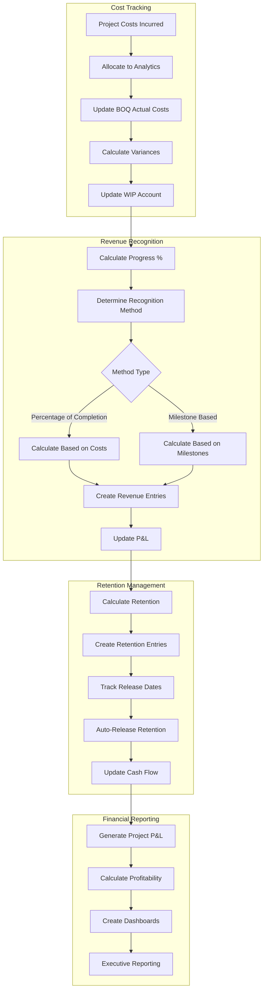
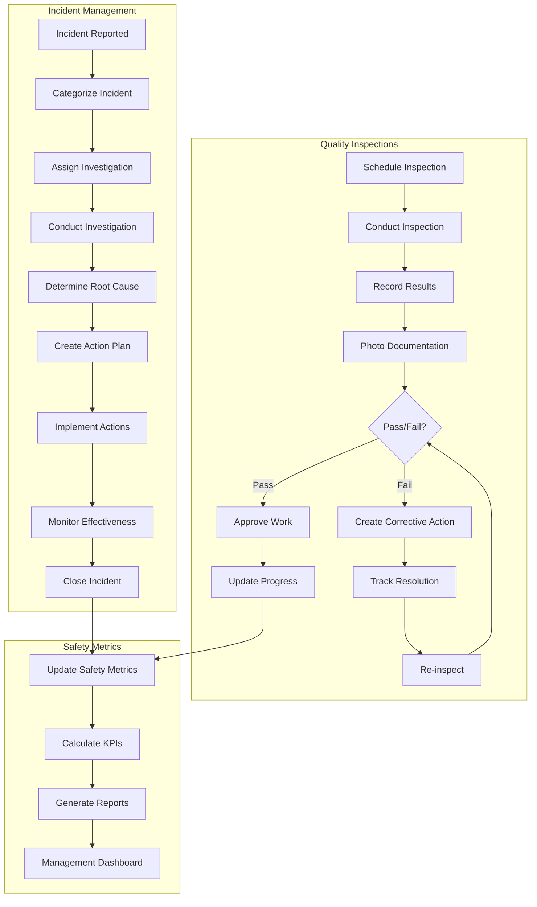
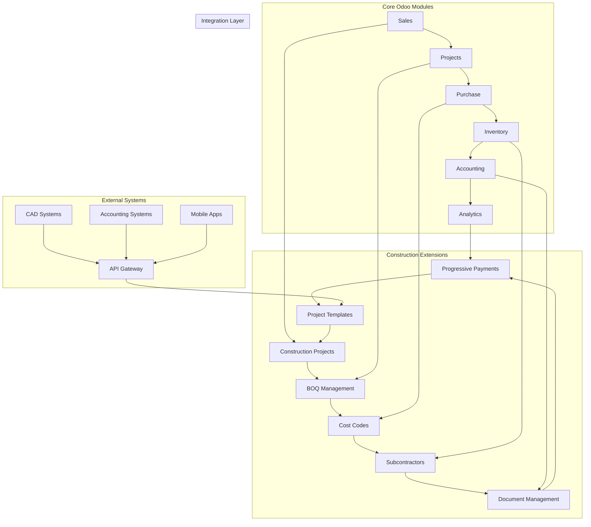

# Complete Construction Management System Flowchart

## System Overview

This document provides comprehensive flowcharts for the complete Construction Management system, including all implemented features from Tasks 1-22.

## 1. Master System Architecture Flow

## 2. Project Template System Flow

## 3. BOQ Management Workflow

## 4. Progressive Payment System Flow

## 5. Procurement Integration Flow

## 6. Subcontractor Management Flow

## 7. Document Management Flow

## 8. Financial Integration Flow

## 9. Quality & Safety Management Flow

## 10. System Integration Points

## Key System Benefits

### 🚀 Automation Benefits
- **80% Reduction** in project setup time through templates
- **90% Accuracy** in cost allocation through automated cost codes
- **Real-time** progress tracking and financial updates
- **Automated** milestone invoice generation and payment tracking

### 📊 Financial Control
- **Complete** cost visibility from BOQ to actual costs
- **Automated** retention management and release
- **Real-time** profitability analysis and variance tracking
- **Integrated** revenue recognition with multiple methods

### 🔧 Operational Efficiency
- **Standardized** project structures through industry templates
- **Streamlined** procurement from BOQ to purchase orders
- **Automated** subcontractor progress tracking and billing
- **Centralized** document management with workflow approval

### 📈 Business Intelligence
- **Executive** dashboards with real-time KPIs
- **Predictive** analytics for project performance
- **Comprehensive** reporting across all project dimensions
- **Mobile-ready** interfaces for field operations

---

*This flowchart documentation represents the complete Construction Management system implementation as of Task 22 completion.*