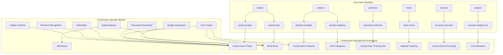
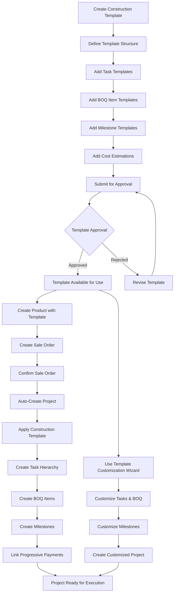
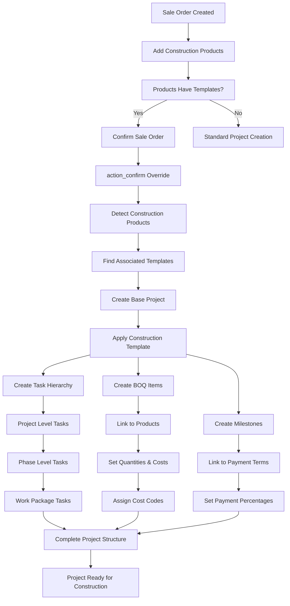
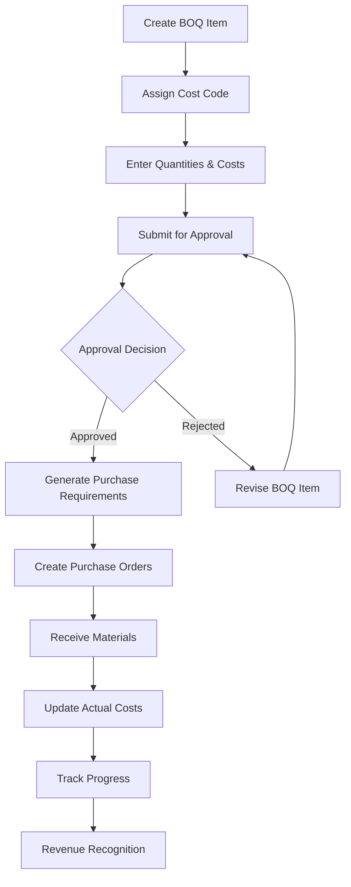
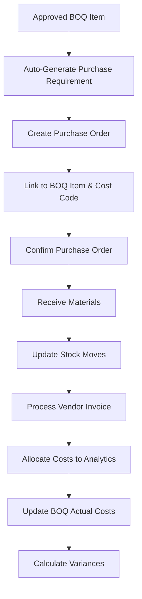
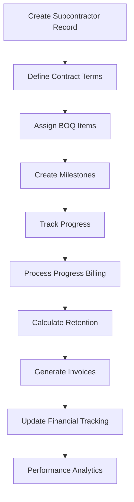
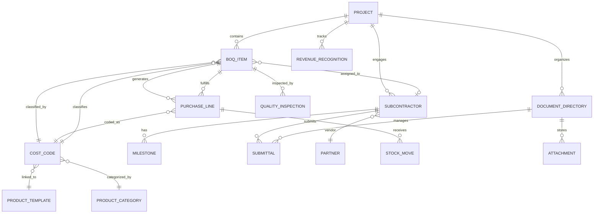

# Construction Management Module for Odoo 17 Enterprise

## 📋 Overview

The Construction Management module is a comprehensive solution built for Odoo 17 Enterprise that provides end-to-end construction project management capabilities. This module extends Odoo's standard project management functionality with construction-specific features including Bill of Quantities (BOQ) management, cost code systems, procurement integration, subcontractor management, document control, and financial integration.

## 🏗️ Module Architecture



## 🎯 Key Features

### ✅ Implemented Features (Tasks 1-22 Complete + BOQ Optimization)

#### 0. **BOQ Code Optimization (Latest Update)**
- **Performance Optimization**: Eliminated multiple database queries in BOQ conflict resolution
- **Single Query Approach**: O(1) database complexity instead of O(N²) for conflict resolution
- **In-Memory Processing**: Fast set and dictionary operations for BOQ code mapping
- **Scalability Enhancement**: Handles hundreds of BOQ items efficiently with consistent performance
- **Progressive Payment Integration**: Seamless integration with milestone-based payment systems
- **Clean Architecture**: Removed circular dependencies between construction and payment modules

#### 1. **Project Management Extensions**
- **Construction Project Types**: Residential, Commercial, Infrastructure, Industrial
- **Site Management**: Location tracking, GPS coordinates, site addresses
- **Contract Management**: Contract values, start/end dates, duration tracking
- **Financial Accounts**: WIP accounts, retention accounts integration

#### 2. **Bill of Quantities (BOQ) Management**
- **BOQ Item Creation**: Unique codes, cost code classification, UOM integration
- **Quantity Tracking**: Estimated, revised, and actual quantities with variance analysis
- **Cost Calculations**: Unit costs, BOQ values, committed costs, actual costs
- **Progress Tracking**: Physical and cost progress monitoring
- **Approval Workflow**: Draft → Submitted → Approved → Rejected → Billed states

#### 3. **Cost Code Management System**
- **Hierarchical Structure**: 6-level cost code hierarchy (MAT.CON.001 format)
- **Cost Type Classification**: Material, Labour, Equipment, Subcontractor, Miscellaneous, Overhead
- **Product Integration**: Seamless integration with Odoo's product catalog
- **Intelligent Suggestions**: Auto-suggestions based on product categories
- **Usage Analytics**: Track cost code usage across projects

#### 4. **Procurement Integration**
- **Purchase Order Extensions**: BOQ task linking, cost code tracking
- **Material Tracking**: Stock move integration with real-time updates
- **Commitment Tracking**: Real-time visibility of committed costs
- **Variance Analysis**: Price variance tracking and alerts

#### 5. **Subcontractor Management**
- **Contract Management**: Contract values, retention percentages, milestone tracking
- **Progress Monitoring**: Weighted progress calculation based on BOQ values
- **Financial Tracking**: Invoiced amounts, retention calculations, payment tracking
- **Performance Analytics**: On-time completion rates, quality scores

#### 6. **Document Management**
- **Directory Structure**: Automatic creation of project document directories
- **Document Types**: Drawings, Specifications, Contracts, Permits, Photos, Reports
- **Submittal Management**: Workflow-based approval processes
- **Version Control**: Document revision tracking

#### 7. **Financial Integration**
- **Revenue Recognition**: Percentage-of-completion and milestone-based methods
- **Retention Management**: Automatic retention calculations and release
- **Analytic Integration**: Seamless integration with Odoo's analytic accounting
- **Cost Allocation**: Automatic cost allocation to BOQ items

#### 8. **Progressive Payment Terms System**
- **Milestone-Based Payments**: Complete milestone lifecycle management (Draft → Ready → Invoiced → Paid)
- **Sub-Milestone Support**: Independent workflow with automatic parent status updates
- **Advanced Invoicing**: Dedicated sale order lines with proportional deduction
- **Smart Automation**: Automatic milestone generation and progress tracking
- **Reset Functionality**: Complete invoice reset with accounting integrity

#### 9. **Project Template System (Enhanced with BOQ Optimization)**
- **Comprehensive Templates**: Industry-standard templates for ELV, MEP, Civil Works, and General Construction
- **Odoo 17 Integration**: Seamless integration with standard sale order confirmation process
- **BOQ Structure Creation**: Automatic task hierarchy (Project → Phase → Work Package)
- **Template Customization**: Wizard-based template customization with conflict prevention
- **Version Management**: Template versioning, approval workflow, and backup system
- **Sale Order Integration**: Automatic template application when sale orders are confirmed
- **Performance Optimized**: Single-query BOQ conflict resolution with O(1) database complexity
- **Progressive Payment Integration**: Dynamic milestone creation from payment terms with fallback to template milestones

## 🔄 System Workflows

### Project Template System Workflow



### Sale Order to Project Template Integration



### BOQ Management Workflow



### Procurement Integration Workflow



### Subcontractor Management Workflow



## 📊 Data Model Relationships



## 🏢 Module Structure

```
construction_management/
├── __init__.py
├── __manifest__.py
├── models/
│   ├── __init__.py
│   ├── construction_project.py          # Project extensions
│   ├── construction_task.py             # BOQ management
│   ├── construction_cost_code.py        # Cost code system
│   ├── product_template.py              # Product extensions
│   ├── construction_subcontractor.py    # Subcontractor management
│   ├── construction_document.py         # Document management
│   ├── construction_revenue_recognition.py # Revenue recognition
│   ├── construction_account.py          # Accounting extensions
│   ├── construction_purchase.py         # Procurement extensions
│   ├── construction_stock.py            # Stock extensions
│   ├── construction_incident.py         # Safety incidents
│   └── construction_quality.py          # Quality inspections
├── views/
│   ├── construction_project_views.xml
│   ├── construction_task_views.xml
│   ├── construction_cost_code_views.xml
│   ├── construction_subcontractor_views.xml
│   ├── construction_document_views.xml
│   └── construction_menu.xml
├── wizard/
│   ├── __init__.py
│   ├── construction_upload_document.py
│   └── construction_assign_subcontractor.py
├── security/
│   ├── construction_security.xml
│   └── ir.model.access.csv
├── data/
│   ├── construction_data.xml
│   └── construction_sequence.xml
├── demo/
│   ├── construction_partners.xml        # 15+ demo partners
│   ├── construction_products.xml        # 25+ demo products
│   ├── construction_cost_codes.xml      # Hierarchical cost codes
│   ├── construction_projects.xml        # 4 demo projects
│   ├── construction_subcontractors.xml  # Subcontractor data
│   ├── construction_documents.xml       # Document management data
│   └── construction_demo.xml            # Main demo file
├── tests/
│   ├── __init__.py
│   ├── test_construction_project.py
│   ├── test_cost_code.py
│   ├── test_document_management.py
│   ├── test_financial_integration.py
│   └── test_subcontractor.py
├── docs/
│   ├── README.md                        # This file
│   ├── ARCHITECTURE.md                  # Technical architecture
│   ├── CONFIGURATION_MENU.md            # Configuration menu structure
│   ├── requirements.md                  # Detailed requirements
│   ├── tasks.md                         # Implementation tasks
│   └── wizard_documentation.md          # Wizard actions documentation
└── static/
    ├── description/
    │   ├── banner.png
    │   └── icon.png
    └── src/
        ├── css/
        ├── js/
        └── xml/
```

## 🎨 User Interface

### 🔧 Configuration Menu Structure

The Construction Management module provides a comprehensive configuration menu that organizes all essential settings into logical groups following standard Odoo conventions. The configuration menu includes 8 main sections:

- **📁 Master Data**: Cost codes, products, categories, and units of measure
- **👥 Partners**: Customers, vendors, and subcontractors management
- **🏗️ Project Settings**: Project stages, task types, and tags
- **💰 Financial Settings**: Chart of accounts, journals, and taxes
- **📄 Document Management**: Document types and organization
- **🔍 Quality & Safety**: Quality inspections and incident management
- **⚙️ System Settings**: Sequences for construction documents
- **📊 Data Management**: Import/export tools and scheduled actions

Each section is properly secured with role-based access control and follows Odoo's standard menu patterns for familiar user experience. For detailed information about the configuration menu structure, see [CONFIGURATION_MENU.md](CONFIGURATION_MENU.md).

### Main Menu Structure
```
Construction
├── Projects
│   ├── Construction Projects
│   └── BOQ Items
├── Configuration
│   ├── Master Data
│   │   ├── Cost Codes
│   │   ├── Products
│   │   ├── Product Categories
│   │   └── Units of Measure
│   ├── Partners
│   │   ├── Customers
│   │   ├── Vendors
│   │   └── Subcontractors
│   ├── Project Settings
│   │   ├── Project Stages
│   │   ├── Task Types
│   │   └── Project Tags
│   ├── Financial Settings
│   │   ├── Chart of Accounts
│   │   ├── Journals
│   │   └── Taxes
│   ├── Document Management
│   │   └── Document Types
│   ├── Quality & Safety
│   │   ├── Quality Inspections
│   │   └── Incident Types
│   ├── System Settings
│   │   └── Sequences
│   └── Data Management
│       ├── Import/Export
│       └── Scheduled Actions
├── Subcontractors
│   ├── Subcontractors
│   └── Milestones
├── Documents
│   ├── Document Directories
│   └── Submittals
└── Reports
    ├── Project Analysis
    ├── Cost Analysis
    └── Progress Reports
```

### Key Views Implemented

#### 1. **Construction Project Dashboard**
- Project overview with key metrics
- BOQ value summary and progress tracking
- Cost variance analysis
- Financial KPIs and profitability

#### 2. **BOQ Management Interface**
- Hierarchical BOQ item tree view
- Quantity and cost tracking forms
- Progress monitoring dashboards
- Approval workflow interface

#### 3. **Cost Code Management**
- Hierarchical cost code tree
- Product integration interface
- Usage analytics and reporting
- Cost code selection widgets

#### 4. **Subcontractor Management**
- Contract management forms
- Progress tracking dashboards
- Milestone management interface
- Performance analytics

## 📈 Reporting and Analytics

### Available Reports
1. **Project Profitability Analysis**
2. **BOQ Cost Variance Reports**
3. **Subcontractor Performance Reports**
4. **Cost Code Usage Analysis**
5. **Progress Tracking Dashboards**
6. **Financial KPI Dashboards**

### Dashboard Features
- Real-time data updates
- Drill-down capabilities
- Interactive charts and graphs
- Export functionality
- Mobile-responsive design

## 🔧 Technical Implementation

### Key Technical Features
- **Odoo 17 Enterprise Compatibility**: Built specifically for Odoo 17 Enterprise
- **Standard Odoo Patterns**: Follows Odoo development best practices
- **Mail Thread Integration**: Full audit trail and activity tracking
- **Analytic Integration**: Seamless cost allocation and tracking
- **Security Framework**: Role-based access control
- **API Ready**: RESTful API endpoints for external integration

### Performance Optimizations
- **Database Indexing**: Optimized queries for large datasets
- **Computed Fields**: Efficient calculation caching
- **Lazy Loading**: Optimized data loading strategies
- **Background Jobs**: Asynchronous processing for heavy operations

## 🚀 Installation and Setup

### Prerequisites
- Odoo 17 Enterprise
- Python 3.8+
- PostgreSQL 12+

### Installation Steps
1. Copy the module to your Odoo addons directory
2. Update the addons list: `./odoo-bin -u all -d your_database`
3. Install the module from Apps menu
4. Configure security groups and permissions
5. Load demo data (optional)

### Configuration
1. **Security Groups**: Assign users to appropriate construction groups
2. **Cost Codes**: Set up your cost code hierarchy
3. **Product Categories**: Configure construction product categories
4. **Document Types**: Customize document directory types
5. **Approval Workflows**: Configure BOQ approval processes

## 📚 Demo Data

The module includes comprehensive demo data:
- **15+ Partners**: Customers, suppliers, subcontractors
- **25+ Products**: Construction materials, labor, equipment
- **Hierarchical Cost Codes**: Complete cost code structure
- **4 Demo Projects**: Different construction types and phases
- **BOQ Items**: Realistic quantities and costs
- **Subcontractor Contracts**: With milestones and retention
- **Document Directories**: Organized project documents
- **Financial Records**: Revenue recognition and cost allocation

## 🔮 Future Enhancements (Planned)

### Phase 2 Features (Tasks 8-12)
- **Budget Management Integration**: Enterprise budget module integration
- **Quality & Safety Management**: Incident tracking and quality inspections
- **Mobile Optimization**: Field-friendly mobile interface
- **Advanced Reporting**: Enhanced analytics and dashboards
- **API Framework**: RESTful APIs for external integration

### Phase 3 Features (Tasks 13-17)
- **Performance Optimization**: Large-scale project support
- **Advanced Integrations**: Third-party system connections
- **Compliance Management**: Regulatory reporting features
- **Advanced Analytics**: AI-powered insights and predictions

## 🤝 Contributing

### Development Guidelines
1. Follow Odoo 17 development standards
2. Maintain comprehensive test coverage
3. Document all new features
4. Use proper commit message conventions
5. Submit pull requests for review

### Testing
- Run unit tests: `python -m pytest tests/`
- Run integration tests: `./odoo-bin --test-enable -d test_db`
- Check code quality: `flake8 construction_management/`

## 📞 Support

For support and questions:
- **Documentation**: Check the docs/ directory
- **Issues**: Report bugs and feature requests
- **Community**: Join the Odoo construction management community

## 📄 License

This module is licensed under LGPL-3. See the LICENSE file for details.

---

**Version**: 17.0.1.0.0  
**Author**: Construction Management Team  
**Compatibility**: Odoo 17 Enterprise  
**Last Updated**: January 2025