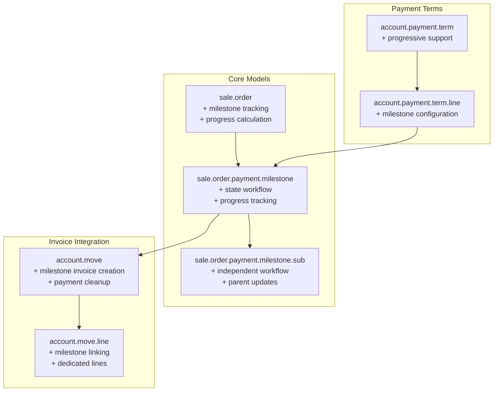
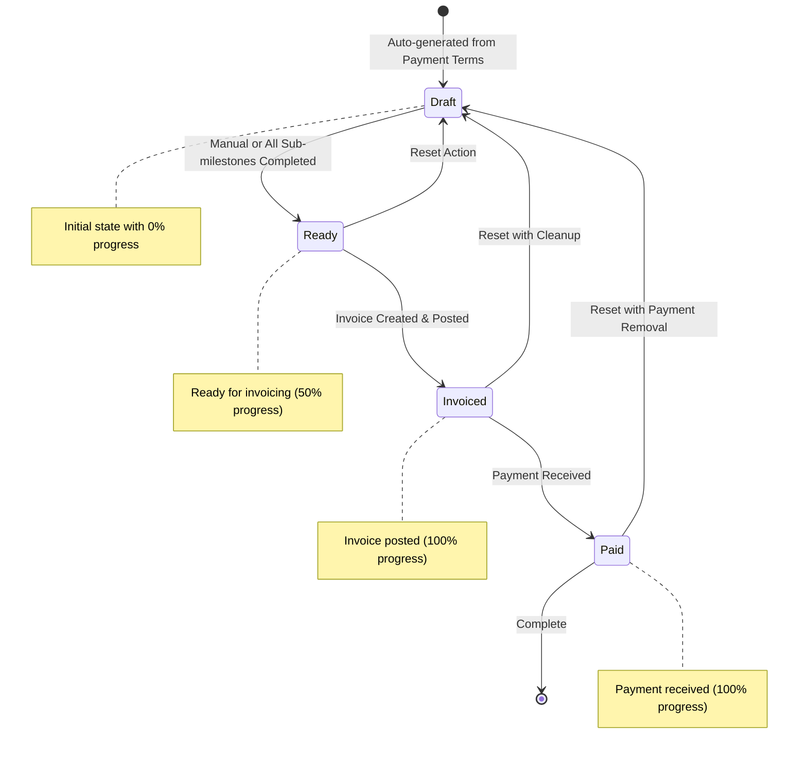
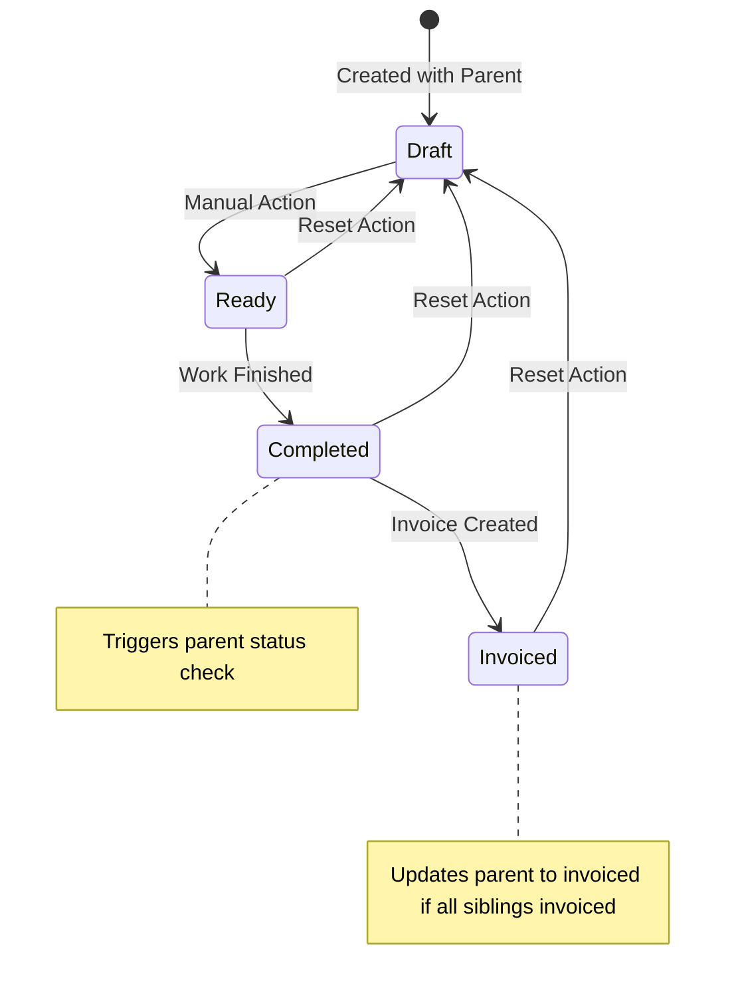
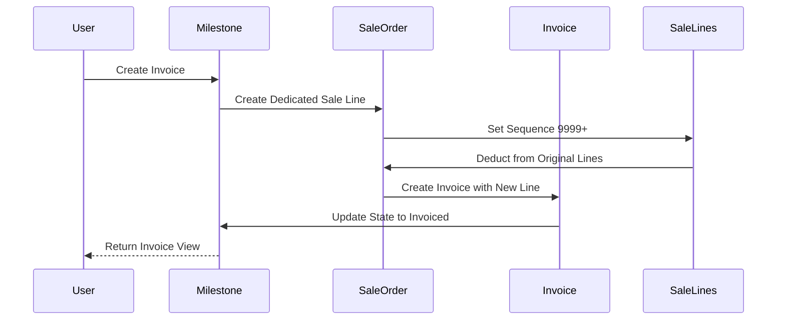
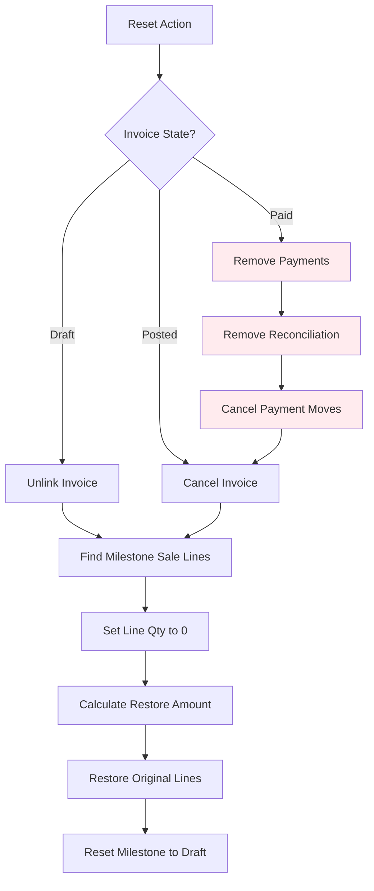

# Construction Progressive Payment Terms Module

## Overview

The Construction Progressive Payment Terms module provides a comprehensive milestone-based payment management system for Odoo 17. This module enables construction companies to manage complex payment schedules, track milestone progress, and automate invoice generation based on project completion stages.

## ✅ Implemented Features

### 🎯 Milestone Management
- **Complete State Workflow**: Draft → Ready → Invoiced → Paid
- **Sub-milestone Support**: Break complex milestones into manageable components
- **Automatic Status Updates**: Parent milestones update based on sub-milestone completion
- **Progress Tracking**: Real-time progress calculation with visual indicators
- **Flexible Configuration**: Support for different milestone types and categories

### 💰 Smart Invoicing
- **Dedicated Sale Order Lines**: Each milestone creates its own sale order line
- **Proportional Deduction**: Original lines reduced proportionally to maintain balance
- **Immediate Payment Terms**: Milestone invoices use immediate payment terms
- **Automated Generation**: Invoices created automatically when milestones are ready
- **Analytic Distribution**: Automatic project costing integration
- **Proper Accounting Integration**: Full integration with Odoo's accounting system

### 🔧 Advanced Reset Functionality
- **Complete Invoice Reset**: Handle draft, posted, and paid invoice states
- **Payment Cleanup**: Remove payment entries and reconciliation for paid invoices
- **Sale Order Line Restoration**: Restore original amounts when resetting milestones
- **Data Integrity**: Maintain accounting integrity throughout reset process
- **Sub-milestone Reset**: Independent reset capability for sub-milestones

### 📊 Real-time Tracking
- **Payment Amount Calculation**: Track invoiced vs paid amounts from invoice residuals
- **Progress Percentage**: Automatic calculation based on milestone/sub-milestone states
- **Visual Indicators**: Progress bars and status badges throughout the interface
- **Dashboard Integration**: Smart buttons for milestone management and tracking

## Architecture Overview



## Complete Workflow

### 1. Milestone Lifecycle



### 2. Sub-milestone Workflow



### 3. Invoice Creation & Sale Order Line Management



### 4. Reset Process with Cleanup



## Key Models and Implementation

### Sale Order Payment Milestone (`sale.order.payment.milestone`)
```python
# Core fields
milestone_name = fields.Char(required=True)
state = fields.Selection([
    ('draft', 'Draft'),
    ('ready', 'Ready'), 
    ('invoiced', 'Invoiced'),
    ('paid', 'Paid')
])
progress_percentage = fields.Float(compute='_compute_progress_percentage')
amount = fields.Monetary()
analytic_account_id = fields.Many2one('account.analytic.account')

# Key methods
def action_set_ready(self)
def action_invoice(self)  
def action_reset_to_draft(self)
def _restore_original_sale_lines(self)
```

### Sale Order Payment Sub-milestone (`sale.order.payment.milestone.sub`)
```python
# Core fields  
parent_milestone_id = fields.Many2one('sale.order.payment.milestone')
state = fields.Selection([
    ('draft', 'Draft'),
    ('ready', 'Ready'),
    ('completed', 'Completed'), 
    ('invoiced', 'Invoiced')
])
analytic_account_id = fields.Many2one(related='parent_milestone_id.analytic_account_id')

# Key methods
def action_complete(self)
def action_create_invoice(self)
def _check_parent_milestone_status(self)
```

### Extended Account Move (`account.move`)
```python
# Key methods
@api.model
def create_milestone_invoice(self, milestone_ids, invoice_vals=None)
def _create_milestone_sale_line(self, sale_order, milestone, sub_milestone=None)
def _update_original_sale_lines(self, sale_order, milestones)
def _get_milestone_analytic_distribution(self, sale_order)
```

## Installation and Setup

### Prerequisites
- Odoo 17.0+
- Standard modules: `account`, `sale`, `project`

### Installation Steps

1. **Install Module**
   ```bash
   # Install via Odoo Apps interface
   Apps → Update Apps List → Search "Construction Progressive Payment Terms" → Install
   ```

2. **Configure Payment Terms**
   ```python
   # Create progressive payment term
   payment_term = env['account.payment.term'].create({
       'name': 'Construction Progressive Payment',
       'is_progressive': True,
       'line_ids': [
           (0, 0, {
               'is_milestone': True,
               'milestone_type': 'advance',
               'value': 'percent',
               'value_amount': 20.0,
           }),
           # Add more milestone lines...
       ]
   })
   ```

3. **Apply to Sale Orders**
   - Create sale order with progressive payment term
   - Milestones auto-generate on order confirmation
   - Manage milestones through dedicated interface

## Usage Examples

### Basic Milestone Management
```python
# Set milestone ready
milestone.action_set_ready()

# Create invoice for ready milestone
invoice = milestone.action_invoice()

# Reset milestone with cleanup
milestone.action_reset_to_draft()
```

### Sub-milestone Workflow
```python
# Complete sub-milestone
sub_milestone.action_complete()

# Create individual sub-milestone invoice
sub_milestone.action_create_invoice()

# Reset sub-milestone
sub_milestone.action_reset_to_draft()
```

### Progress Tracking
```python
# Get milestone progress
progress = milestone.progress_percentage

# Get sale order payment summary
total_amount = sale_order.total_milestone_amount
invoiced_amount = sale_order.invoiced_milestone_amount  
paid_amount = sale_order.paid_milestone_amount
overall_progress = sale_order.milestone_progress
```

## User Interface Features

### Sale Order Integration
- **Smart Buttons**: Quick access to milestones, dashboard, and unified views
- **Progress Indicators**: Visual progress bars and monetary summaries
- **Action Buttons**: Context-sensitive buttons based on milestone states
- **Sub-milestone Management**: Inline management of sub-milestones

### Milestone Views
- **State-based Decorations**: Color-coded tree views based on milestone states
- **Progress Visualization**: Progress bars showing completion percentages
- **Action Integration**: Direct action buttons for state transitions
- **Dashboard Views**: Comprehensive milestone tracking and management

## Technical Excellence

### Performance Optimizations
- **Computed Field Dependencies**: Optimized `@api.depends` for real-time updates
- **Efficient Queries**: Minimal database queries for progress calculations
- **Proper Indexing**: Database indexes for milestone-related queries
- **Batch Operations**: Efficient handling of multiple milestone operations

### Data Integrity
- **Comprehensive Validation**: Field constraints and business rule validation
- **Transaction Safety**: All operations wrapped in proper transactions
- **Cascade Handling**: Proper cleanup when records are deleted
- **Audit Trails**: Complete tracking of milestone state changes

### Error Handling
- **Graceful Failures**: Proper error handling for all edge cases
- **User-friendly Messages**: Clear error messages with actionable guidance
- **Recovery Mechanisms**: Ability to recover from failed operations
- **Logging**: Comprehensive logging for debugging and monitoring

## API Reference

### Core Methods

#### Milestone Management
- `action_set_ready()`: Mark milestone as ready for invoicing
- `action_invoice()`: Create invoice for milestone
- `action_reset_to_draft()`: Reset milestone with complete cleanup
- `_compute_progress_percentage()`: Calculate milestone progress

#### Sub-milestone Management  
- `action_complete()`: Mark sub-milestone as completed
- `action_create_invoice()`: Create individual sub-milestone invoice
- `_check_parent_milestone_status()`: Update parent milestone status

#### Invoice Operations
- `create_milestone_invoice()`: Create milestone invoice with dedicated lines
- `_restore_original_sale_lines()`: Restore sale order lines after reset
- `_remove_invoice_payments()`: Clean up payments when resetting

## Configuration Options

### Milestone Types
- **Advance Payment**: Upfront payment before work begins
- **Material Delivery**: Payment upon material delivery
- **Work Completion**: Payment upon work completion
- **Testing & Commissioning**: Payment after testing
- **Final Payment**: Final project payment
- **Retention Release**: Retention amount release

### Progress Calculation
- **State-based**: Progress based on milestone states (Draft=0%, Ready=50%, Invoiced/Paid=100%)
- **Sub-milestone based**: Progress calculated from completed/invoiced sub-milestones
- **Real-time Updates**: Automatic recalculation on state changes

## Troubleshooting

### Common Issues

1. **Progress not updating**
   - Check computed field dependencies
   - Verify sub-milestone states are updating parent

2. **Invoice reset not working**
   - Ensure proper permissions for payment cleanup
   - Check invoice state and payment reconciliation

3. **Sale order lines not restoring**
   - Verify milestone lines have sequence >= 9999
   - Check proportional calculation logic

### Debug Features
- Enable developer mode for additional milestone management options
- Access to manual state transitions and amount adjustments
- Advanced logging for troubleshooting complex scenarios

## Testing

### Test Coverage
- **Unit Tests**: Complete coverage of all model methods
- **Integration Tests**: End-to-end workflow testing
- **Performance Tests**: Load testing with large datasets
- **UI Tests**: User interface interaction testing

### Running Tests
```bash
# Run all tests
python -m pytest tests/

# Run specific test file
python -m pytest tests/test_progressive_payment_terms.py

# Run with coverage
python -m pytest --cov=models tests/
```

## Contributing

### Development Guidelines
- Follow Odoo coding standards
- Write comprehensive tests for new features
- Update documentation for any changes
- Use proper commit message format

### Code Quality
- **Clean Architecture**: Proper separation of concerns
- **Readable Code**: Self-documenting code with minimal comments
- **Performance**: Optimized database queries and computed fields
- **Security**: Proper access controls and validation

## License

This module is licensed under LGPL-3.0. See LICENSE file for details.

## Changelog

### Version 1.0.0 ✅
- ✅ Complete milestone-based payment workflow
- ✅ Sub-milestone support with independent workflow  
- ✅ Advanced invoice reset with payment cleanup
- ✅ Real-time progress tracking and payment calculations
- ✅ Dedicated sale order line management
- ✅ **Analytic account integration for project costing**
- ✅ Comprehensive UI with visual indicators
- ✅ Smart automation and status updates
- ✅ Complete accounting integration

### Future Enhancements
- Mobile app integration for field updates
- Advanced analytics and reporting
- API endpoints for external integrations
- Multi-project milestone management
- Quality gate integration