# Workflow Diagrams - Progressive Payment Terms

## Overview

This document provides comprehensive workflow diagrams for the Progressive Payment Terms system, illustrating all implemented processes, state transitions, and integration points.

## Main System Workflow

### Complete Progressive Payment Lifecycle

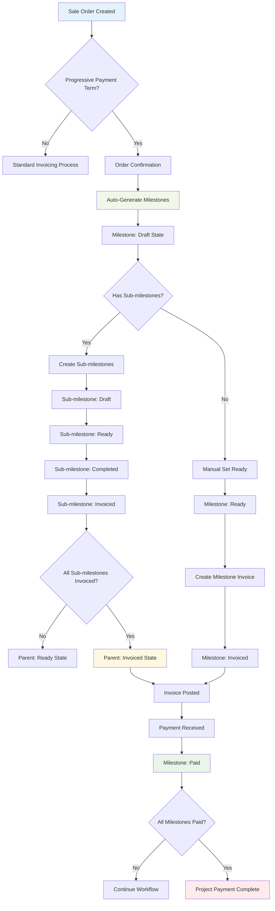

## Milestone State Management

### Parent Milestone States

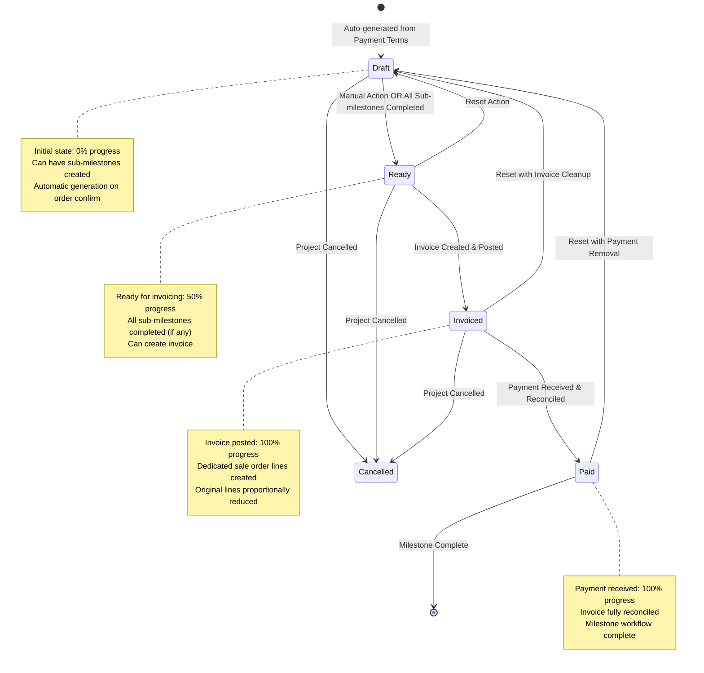

### Sub-milestone States

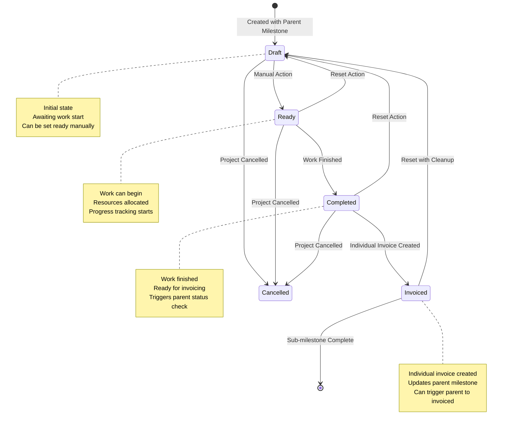

## Invoice Creation Workflows

### Milestone Invoice Creation Process

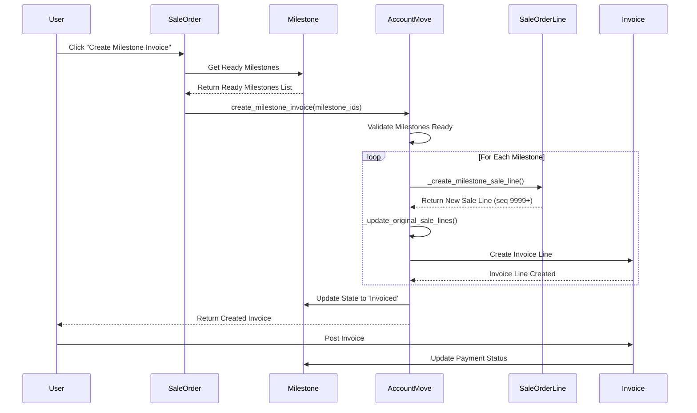

### Sub-milestone Individual Invoicing

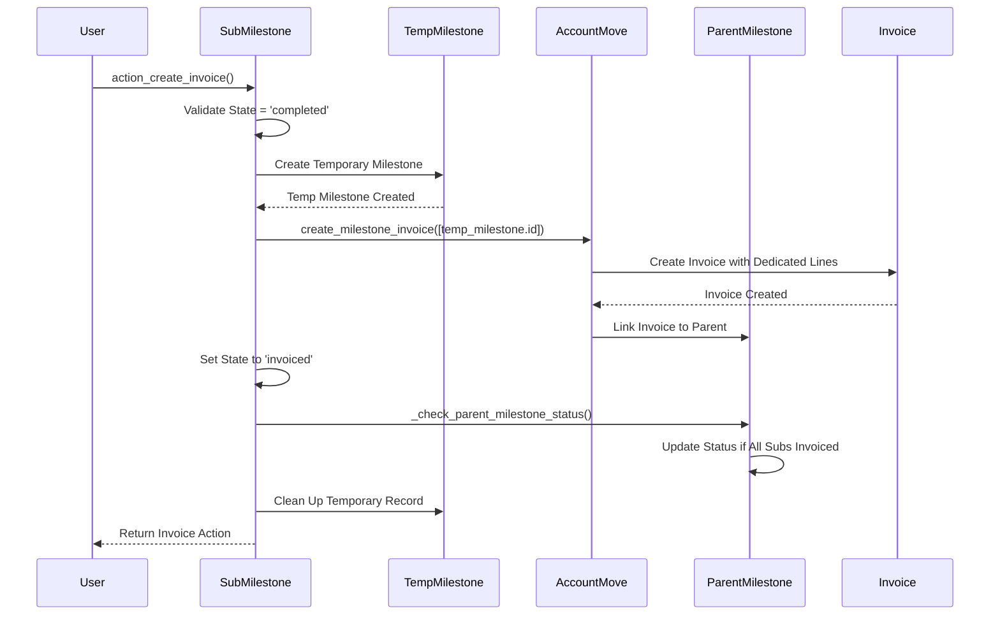

## Sale Order Line Management

### Dedicated Line Creation and Management

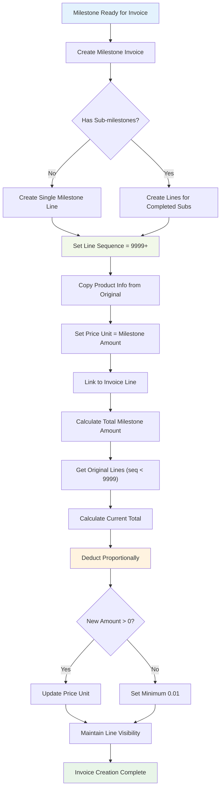

### Sale Order Line Restoration Process

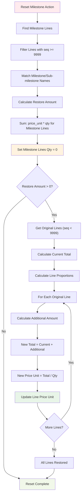

## Reset and Cleanup Workflows

### Complete Invoice Reset Process

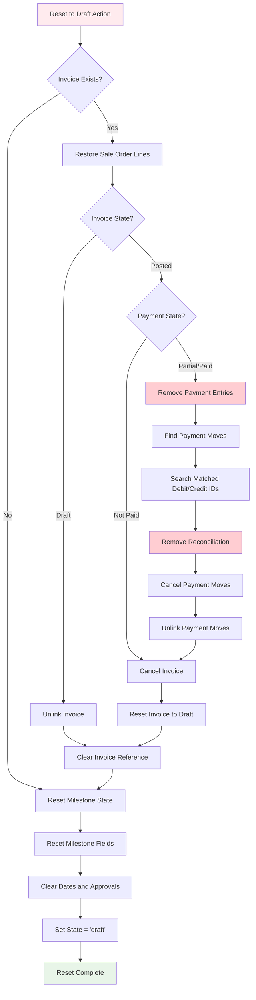

### Sub-milestone Reset with Parent Updates

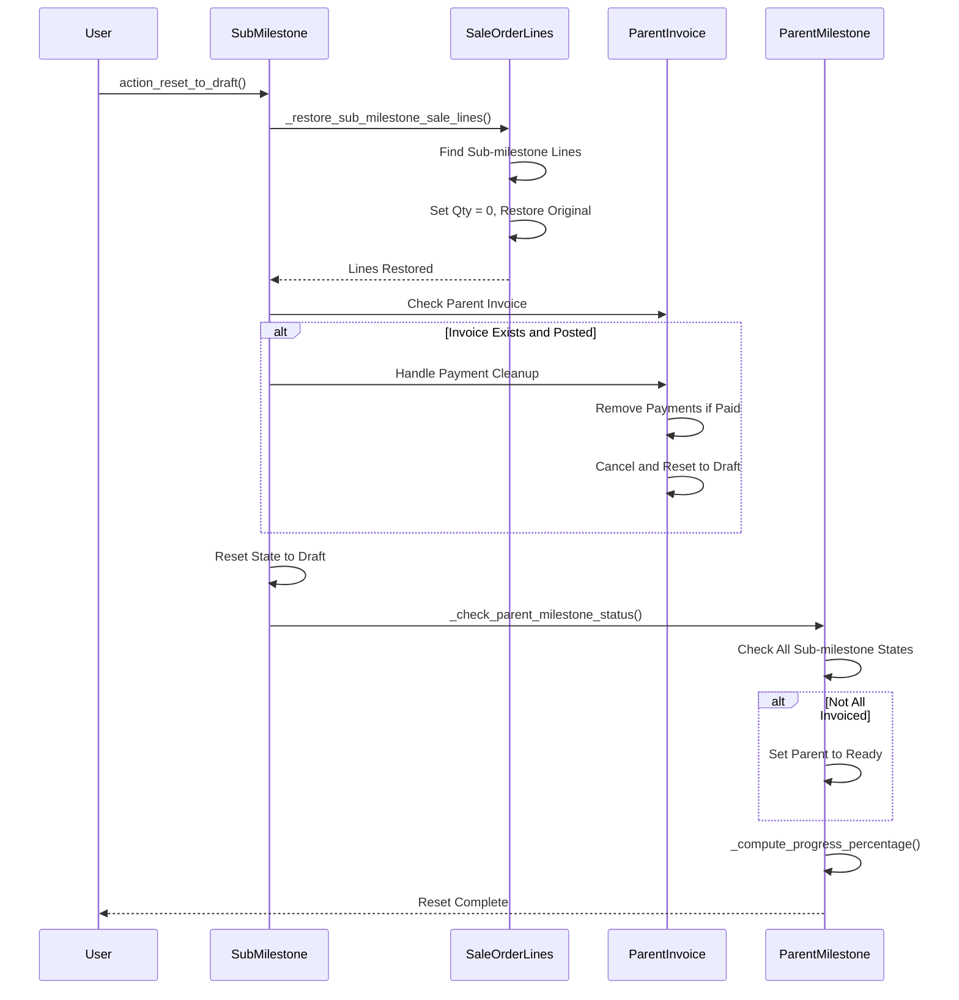

## Progress Calculation Workflows

### Smart Progress Calculation Logic

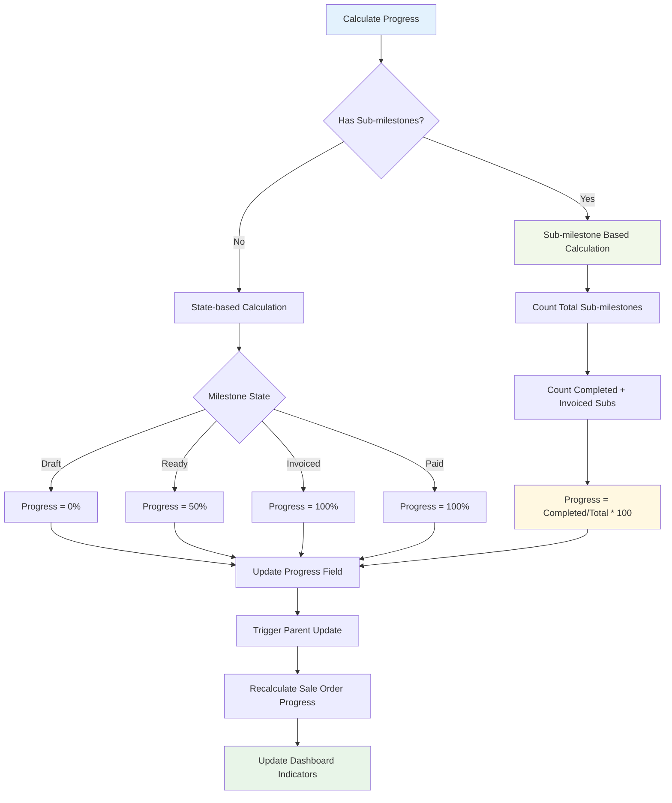

### Sale Order Progress Aggregation

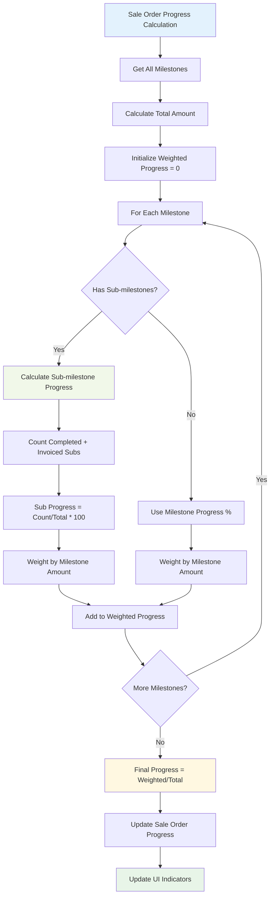

## Payment Amount Tracking

### Real-time Payment Calculation

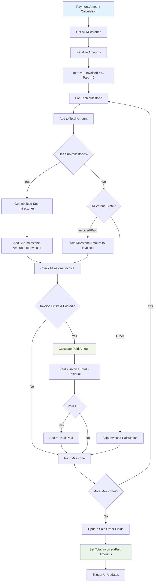

## Integration Workflows

### Accounting Integration Flow

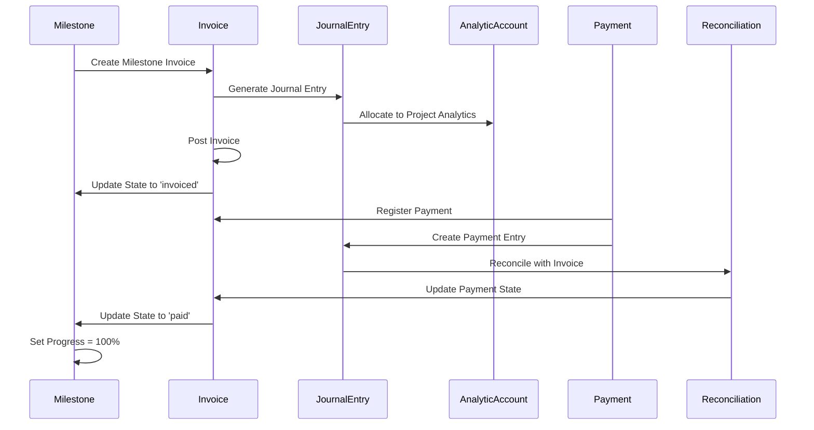

### Project Management Integration

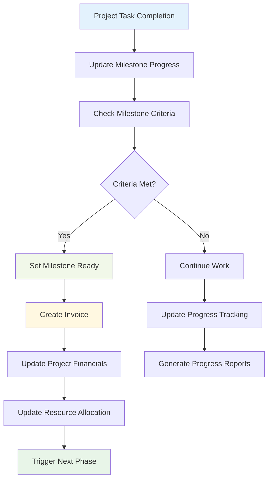

## Error Handling Workflows

### Validation and Error Recovery

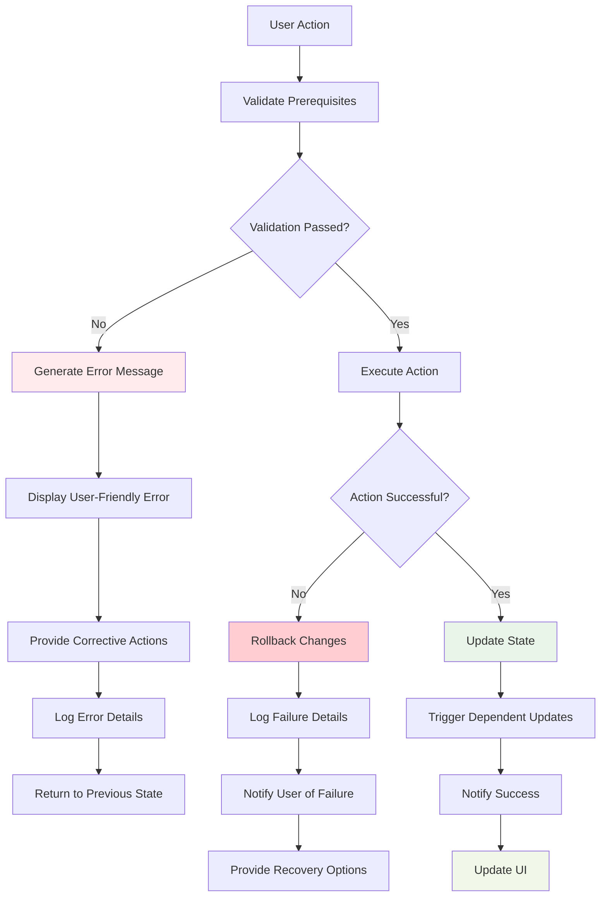

## Performance Optimization Workflows

### Efficient Data Processing

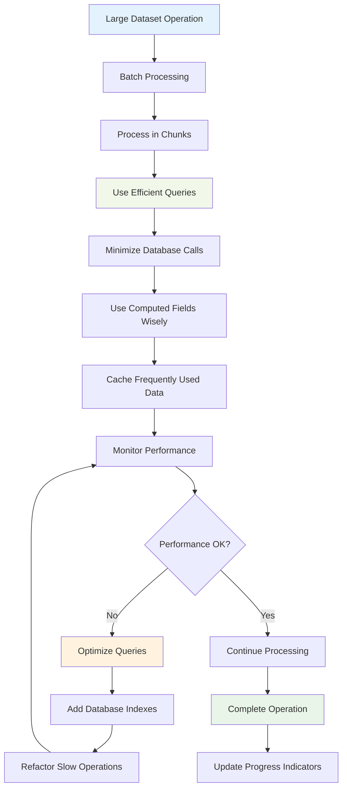

These workflow diagrams provide comprehensive visual documentation of all implemented processes in the Progressive Payment Terms system, covering normal operations, error handling, and optimization strategies.